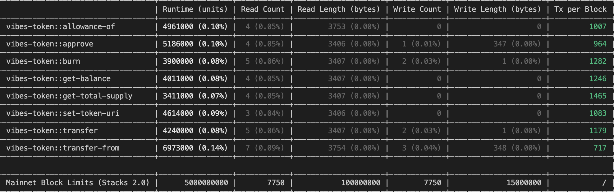

# HireVibes (VIBES) Token Contract (Stacks)

## Token Contract Actions
- Transfer
- Burn
- Approve
- Mint
- TransferFrom

## Tests
- Transfer
- Burn
- Approve
- Transfer From

## Contract calls cost synthesis
 

## HVT-to-VIBES Migration Process:

1. There are 350,000,000 HireVibes Tokens on the EOS blockchain. All 350,000,000 tokens will be minted on Stacks in a HireVibes admin wallet 
2. Once tokens are minted and ready to claim; the EOS token contract will be paused so that no EOS-HVT transactions can not occur
3. On HireVibes website, users will be directed to create a Stacks blockchain address
4. A Claim Widget on HireVibes website will enable a user to connect their EOS wallet address to the widget and insert their Stacks address 
5. Whenever a user inserts their Stacks address to claims their new VIBES tokens: HV admin team will perform a send transaction from the HV admin wallet to send their new VIBES tokens to their specified Stacks address

*There will be a disclaimer on HV website that the user is responsible for inputting their correct Stacks address, otherwise they will lose their tokens 

*Users that have staked EOS-HV-Tokens will be able to claim their new VIBES tokens without unstaking 

Token contract live on Stacks can be seen here: https://explorer.hiro.so/txid/SP27BB1Y2DGSXZHS7G9YHKTSH6KQ6BD3QG0AN3CR9.vibes-token?chain=mainnet
